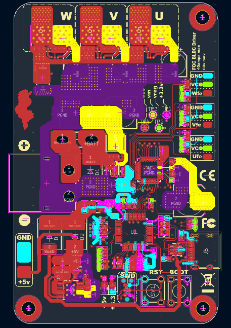
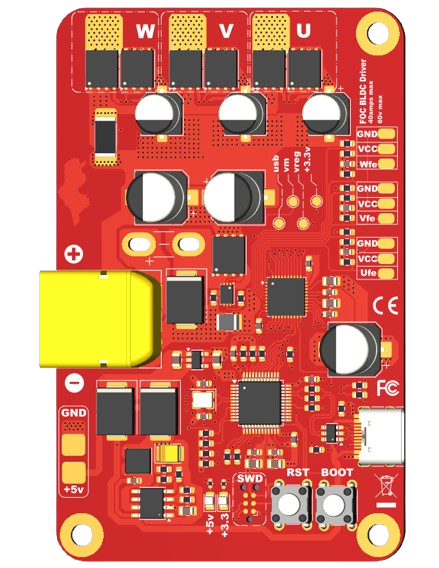
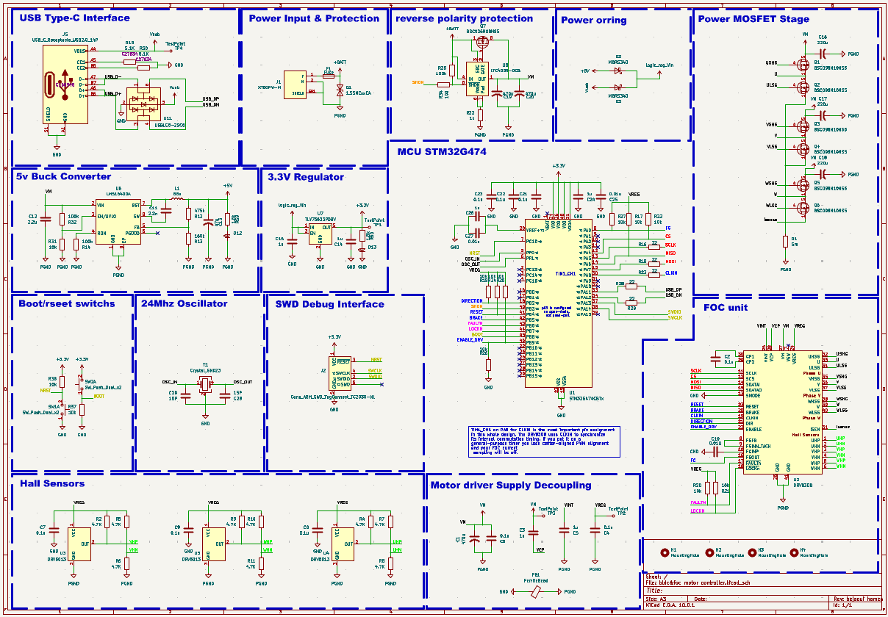

# FOC BLDC Motor Controller

> High-performance Field-Oriented Control driver built around the **STM32G474** MCU and **DRV8308** gate driver.

**[🌐 Live Project Page](https://bejaouihamza.github.io/bldc-foc-pcb/)**

---

## Overview

This open-source hardware project is a compact, single-board FOC (Field-Oriented Control) motor driver designed for precision robotics, drones, CNC machines, and automation systems. It delivers smooth sinusoidal torque control with minimal audible noise thanks to Space Vector PWM (SVPWM) modulation.

| Spec | Value |
|------|-------|
| Input Voltage | 8.5V – 32V DC |
| Max Continuous Current | 50A |
| Peak Current | 100A (transient) |
| MCU | STM32G474CBTx (170 MHz, Cortex-M4) |
| Gate Driver | DRV8308 (SPI-configurable) |
| MOSFETs | 6× BSC098N10NS5 (100V, 9.8mΩ) |
| PWM Frequency | 20 kHz (center-aligned) |
| Commutation | Trapezoidal or 180° sinusoidal FOC |
| Sensors | 3× Hall differential inputs |
| Interface | USB-C + ARM SWD debug |

---

## Hardware

### PCB Layout (Top Layer)



The top layer shows the complete copper layout with phase outputs **U, V, W** at the top, power input (**XT60**) on the left, and the control section (STM32G474 + DRV8308) in the center. Note the star-grounding strategy and wide power traces for high-current paths.

### 3D Render



Compact form factor (~85mm × 55mm) with 4× M3 mounting holes. The large electrolytic capacitors handle bulk energy storage while the XT60 connector delivers main battery power.

### Schematic



The design is organized into clear functional blocks:
- **Power Input & Protection** — XT60 connector, fuse, reverse-polarity diode, LTC4359 ideal diode
- **5V Buck** — LM5164DDA switching regulator
- **3.3V LDO** — TLV75533 for clean logic supply
- **MCU** — STM32G474 with 24MHz crystal, USB-C, SWD, BOOT/RESET switches
- **FOC Unit** — DRV8308 gate driver with SPI configuration
- **Power Stage** — 6× BSC098N10NS5 MOSFETs in 3-phase bridge configuration
- **Hall Sensors** — 3× DRV5013 with 4.7kΩ pull-ups and VREG supply

---

## Architecture

### FOC Control Loop

```
Speed Ref (ω*) → Speed PI → Iq*
                              ↓
                    ┌─────────────────┐
Id*=0 → Current PI │  Inverse Park   │ → Vα,Vβ → SVPWM → DRV8308 → 3-Phase Bridge → Motor
        Iq → Current PI │  (d-q → α-β)   │         ↑
                    └─────────────────┘         │
                           ↑                    │
    Hall → Estimator → θ,ω  │                    │
           ↑                │                    │
    Current Sense → Clarke → Park → Id,Iq (feedback)
```

The STM32G474 runs the full FOC algorithm:
1. **Speed PI** — compares reference vs. actual speed, outputs torque command
2. **Current PI (×2)** — regulates Id=0 and Iq=Iq* in the rotating d-q frame
3. **Inverse Park** — converts Vd,Vq → Vα,Vβ (rotating → stationary)
4. **SVPWM** — Space Vector modulation for 15% better DC bus utilization vs. sine PWM
5. **Feedback** — Hall sensors provide rotor position; 5mΩ shunt (R1) senses phase current

### Critical Pin Assignment

| Pin | Function | Connected To |
|-----|----------|--------------|
| **PA8** | TIM1_CH1 / CLKIN | DRV8308 CLKIN *(most important!)* |
| PA4-PA7 | SPI1 | DRV8308 SCS/SCLK/SDATAO/SDATAI |
| PB0 | DIRECTION | DRV8308 DIR |
| PB1 | SHDN | DRV8308 SHDN |
| PB7 | ENABLE | DRV8308 ENABLE |
| PB4 | FAULTn | DRV8308 FAULTn (input) |

> ⚠️ **TIM1_CH1 on PA8 is critical** — it synchronizes DRV8308 internal commutation timing. Moving it to a general-purpose timer breaks center-aligned PWM alignment.

---

## Firmware

### STM32 HAL Example

```c
/* Initialize DRV8308 for 180° sinusoidal FOC */
void DRV8308_Init(void) {
    // SYSOPT1: Enable sine mode
    DRV8308_WriteReg(DRV8308_SYSOPT1, 0x8000);  // SINMODE=1

    // SYSOPT2: 50mA gate drive for BSC098N10NS5
    DRV8308_WriteReg(DRV8308_SYSOPT2, 0x0300);  // IDRIVE=011

    // SYSOPT3: 1µs dead time
    DRV8308_WriteReg(DRV8308_SYSOPT3, 0x0040);

    // SYSOPT9: 50A overcurrent (0.25V / 5mΩ)
    DRV8308_WriteReg(DRV8308_SYSOPT9, 0x0000);
}

/* TIM1 center-aligned PWM for CLKIN */
void TIM1_PWM_Init(void) {
    htim1.Instance = TIM1;
    htim1.Init.Prescaler = 0;
    htim1.Init.CounterMode = TIM_COUNTERMODE_CENTERALIGNED1;
    htim1.Init.Period = 4250;  // 170MHz / (2×4250) = 20kHz
    // ...
    HAL_TIM_PWM_Start(&htim1, TIM_CHANNEL_1);
}
```

### Arduino / SimpleFOC

Also compatible with the [SimpleFOC](https://simplefoc.com/) library for rapid prototyping:

```cpp
BLDCMotor motor = BLDCMotor(11);  // 11 pole pairs
BLDCDriver3PWM driver = BLDCDriver3PWM(9, 10, 11, 8);
HallSensor sensor = HallSensor(2, 3, 4, 11);

motor.foc_modulation = FOCModulationType::SpaceVectorPWM;
motor.controller = MotionControlType::velocity;
motor.init();
motor.initFOC();
```

See the **[live project page](https://bejaouihamza.github.io/bldc-foc-pcb/)** for the complete code examples, wiring guide, and interactive SVPWM block diagram.

---

## Wiring

| Connection | Pin/Port | Notes |
|------------|----------|-------|
| Battery | XT60 | 8.5-32V DC |
| Motor U/V/W | Top screw terminals | Thick wire, high current |
| Hall VCC | VREG pin | 5V from DRV8308 |
| Hall GND | GND pin | Common ground |
| Hall signals | UHP/UHN, VHP/VHN, WHP/WHN | Differential pairs |
| Programming | SWD header | ST-Link V2/V3 |
| Serial/USB | USB-C | DFU bootloader + CDC |

---

## Bill of Materials (Key Components)

| Ref | Part | Description |
|-----|------|-------------|
| U1 | STM32G474CBTx | 170 MHz Cortex-M4 MCU |
| U2 | DRV8308 | 3-phase gate driver with SPI |
| Q1-Q6 | BSC098N10NS5 | 100V, 9.8mΩ N-channel MOSFET |
| U6 | LM5164DDA | 5V buck converter |
| U7 | TLV75533PDBV | 3.3V LDO |
| U8 | LTC4359 | Ideal diode controller |
| U3-U5 | DRV5013 | Hall sensors |
| Y1 | 24 MHz | Crystal oscillator |
| J1 | XT60PW-M | Battery connector |
| J5 | USB-C | USB 2.0 receptacle |

---

## Protection Features

- ✅ Reverse polarity (LTC4359 + diode)
- ✅ Overcurrent (cycle-by-cycle, 50A limit)
- ✅ Undervoltage lockout (UVLO)
- ✅ Overtemperature shutdown
- ✅ Rotor lock detection
- ✅ Fuse on battery input

---

## Getting Started

1. **Power up** — Connect 12-24V battery to XT60. Verify 5V and 3.3V LEDs.
2. **Connect motor** — Wire BLDC phases and Hall sensors.
3. **Flash firmware** — Use ST-Link on SWD header or DFU over USB-C.
4. **Configure DRV8308** — Run SPI init sequence (see code above).
5. **Spin** — Enable driver, set direction, send CLKIN frequency. Start at 100 Hz, ramp up slowly.

---

## Project Structure

```
bldc-foc-pcb/
├── index.html              # Landing page (GitHub Pages)
├── pcb-layout-top.png      # Top layer copper layout
├── pcb-render.png          # 3D render
├── schematic-full.png      # Complete KiCad schematic
├── README.md               # This file
└── bldc&foc motor controller.pdf  # Original schematic PDF
```

---

## License

Open source hardware. Feel free to use, modify, and distribute. Attribution appreciated.

---

**Designed by [bejaoui hamza](https://github.com/bejaouihamza)** · KiCad EDA 10.0.1
